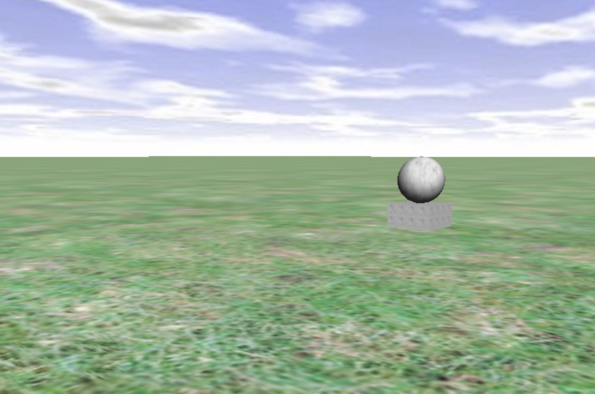

# 4.1 Skulpturengarten

Nachdem Sie nun bereits ein erstes Schiebpuzzle kreiert haben, sollen Ihre Fähigkeiten bei der Programmierung eines Skulpturengartens trainiert werden.

## Aufgabenstellung

Erstellen Sie einen Skulpturengarten, in dem Sie beliebige Arten von Skulpturen designen und kreisförmig um einen Mittelpunkt anordnen. Verwenden Sie als Grundlage,den Code aus 

[Hallo! Leere Welt!](4.1-skulpturengarten.md##Hallo!%20Leere%20Welt!)

.  




## Hallo! Leere Welt!

```java
import GLOOP.*;
class HalloWelt{
//Kamera und Umgebung deklarieren
GLKamera kamera;
GLLicht licht;
GLBoden boden;
GLHimmel himmel;


HalloWelt(){
//Kamera und Umgebung instanziieren
kamera = new GLSchwenkkamera();
kamera.setzePosition(0,300,500);
licht = new GLLicht();
boden = new GLBoden("Gras.jpg");
himmel = new GLHimmel("Himmel.jpg"); 
}
}
```

**Tipp** Verwende für die kreisförmige Anordnung der Objekte [Methoden aus der Grundlagenübersicht](../2.-grundlagen/2.2-klassen-methodenuebersicht-zu-gloop.md#GLOOP-Objekte).

